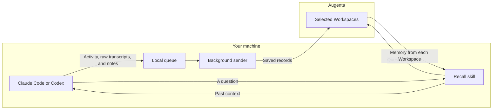

# How the plugin works

The plugin has three jobs: connect a project, save its activity, and ask about
past work. It runs on your machine. Augenta stores the memory and returns
matching context; `--answer` optionally asks its model to write an answer.

## The two paths

Saving happens through **hooks**: small scripts your coding app runs at points
such as the end of a turn. Recall happens when you or your agent calls the
recall skill. The hooks do not fetch answers or add remembered context to each
new chat. The recall skill brings remembered context back into the task.

This repository contains those scripts and two skills, `connect` and `recall`.
It does not contain the hosted memory engine or train your coding model.

## 1. Connect a project

The [connect script](../scripts/connect.ts) gives you a browser sign-in link. It
lists the Workspaces you can use and asks for the complete set this project
should send to. Nothing is selected on your behalf.

Each Workspace gets its own Connector. The project config stores those
Connector ids inside `destinations`, the chosen Workspace ids and names,
organization, control URL, gateway, and a reference to your saved sign-in.
Only Connector ids route capture; the server still authorizes every read.
Recall checks each selected Connector is active and still points to its saved
Workspace before asking it, and refreshes display names best-effort without
rewriting config. Tokens stay in a
private file in your home folder. See [connection settings](configuration.md).

Capture checks for `.augenta/config.json` in the working folder and its
parents. With no readable config, it saves and sends nothing. Session start
can offer to connect an unconnected project once.

Connect, recall, capture and health use the same local config lookup. It stops
at a Git checkout/worktree boundary, including worktrees nested below another
checkout. Connect defaults to the current checkout, never its main checkout.
Each worktree must be connected explicitly; sibling and main-checkout consent
is not inherited. The nearest config wins, including an invalid config (which
requires reconnecting rather than falling through to another project). An
explicit `--project` targets that directory. See [project resolution](../capture/project.ts).

## 2. Save work locally

The [capture hook](../capture/capture.ts) reads new transcript lines and tracks
where it stopped. For Codex, native `task_started`, `turn_context` and
`task_complete` records determine each logical turn. Their IDs and parser state
are saved with the byte cursor, so a delayed read can contain several turns
without merging them. Records without a known native boundary carry
`turn_source: "unknown"`; messages are never guessed to be turn boundaries.
Claude Code retains its prompt-hook ordinal.

New connections store a `captureSince` timestamp. Codex excludes turns already
in progress at that time, including the connection turn and older history.
Existing configs without that field retain their existing capture scope; they
are not silently rewritten. Reconnecting establishes a new timestamp. This does
not expand project-memory capture or grant consent to a historical import.

A short project lock serializes capture/append/cursor commits across processes.
A contender waits at most 750 ms, then reports `retry` without changing the cursor;
a later lifecycle event retries. It writes three types of records to a queue on disk:

- Activity in a common format for Claude Code and Codex.
- Raw transcript records, with some internal fields removed.
- Changed project memory notes, saved as separate documents.

Activity and memory notes have common secret patterns removed. Raw transcript
text does not. The [privacy details](../README.md#what-gets-captured) apply to
every selected Workspace.

[Memory capture](../capture/memory.ts) reads Claude's project memory folder or
the sections of Codex's memory file that match the project. It checks for
changes at session start and the end of a turn. It does not scan all source
files in the repository.

The capture step writes to disk without waiting for a network request or a
model response.

## 3. Send saved records

The [background sender](../capture/ship.ts) groups records into requests and
sends them to `POST /v1/experiences`. It keeps a separate delivery position
for each Connector, so one Workspace can retry while others receive their
records. They share the same local queue and its limits.

Pending records can survive a restart. Sending is retried at later turn or
session boundaries. This queue is temporary and has limits:

| Limit or failure | What happens |
| --- | --- |
| The queue reaches 50 MiB | New records are dropped until space is available |
| One destination falls more than 16 MiB behind the furthest one | Older queued records can be discarded after three consecutive queue drains in which it sends nothing and another destination makes progress |
| All destinations are offline | That lag rule does not apply; the overall queue limit still does |
| The API rejects a request with 400, 413, or 422 | The sender records the rejection locally, within a 10 MiB limit, and moves on |
| A network error or other failed HTTP response | The affected records stay queued for a later attempt, subject to the limits above |

Successful delivery resets a destination's lag count. Discards are reported
separately from sign-in problems: discarded records will not be retried.
The queue is not a backup. See [outbox rules](../capture/outbox.ts).

## 4. Recall past work

The [recall script](../scripts/recall.ts) checks the project's Connectors live
and sends a question to `POST /v1/recall` only for active links that still match
their recorded Workspaces. By default it asks
all of them at once. A caller can narrow that set but cannot add an unconnected
Workspace.

The request body holds the question and, for browser sign-in, the Workspace
id. No transcript or file content is attached. The API decides the allowed
organization and memory scope from the signed-in identity. An API key already
fixes the Workspace, so that request needs only the question.

By default the script returns the matched summary and supporting notes for
your agent to answer from. `--answer` requests model-written prose instead.
It reports results, empty Workspaces, and failures separately. An
empty Workspace is a normal result. A failure in one is not presented as a
successful answer from all of them.

Disabled, inaccessible, or retargeted links are reported as unresolved and are
not used for recall. A failed Connector check also prevents its question from
being sent, but is reported as a failure rather than a disabled link. Multiple
active links to one Workspace produce only one recall request.

A Workspace refusal after a successful link check retains its code and message
in `failed` alongside the affected unresolved ids. This distinguishes entitlement
denials and archived Workspaces from disabled links. Workspace names are fetched
best-effort after link checks, concurrently with recall, so an all-disabled set
does not trigger a name lookup and name listing never gates the recall POSTs.

Recall uses the saved project config even when `AUGENTA_CAPTURE_ENABLED=0`.
Deleting the config turns off both paths.

## Code map

| Location | Job |
| --- | --- |
| [`skills/`](../skills/) | Instructions the agent follows for connect and recall |
| [`hooks/hooks.json`](../hooks/hooks.json) | Eight app events and the scripts they run |
| [`hooks/`](../hooks/) | Session setup and turn tracking |
| [`capture/`](../capture/) | Read records, clean them, queue them, and send them |
| [`scripts/connect.ts`](../scripts/connect.ts) | Sign-in and Workspace selection |
| [`scripts/recall.ts`](../scripts/recall.ts) | Ask the selected Workspaces a question |
| [`runtime/`](../runtime/) | Shared Node helpers and plugin version |
| [`dist/`](../dist/) | Six ready-to-run Node bundles installed by both apps |
| [`__tests__/contract.test.ts`](../__tests__/contract.test.ts) | Checks the plugin's rules, including key privacy and setup wording |

Contributors use Bun to build and test. Users need Node 20 or newer. Both
marketplaces install the committed bundles without a build step. The build
checks the Bun version and local dependencies so the output stays the same.

See [Contributing](../CONTRIBUTING.md) for checks and
[AGENTS.md](../AGENTS.md) for the full rules on packaging, releases, and privacy.
