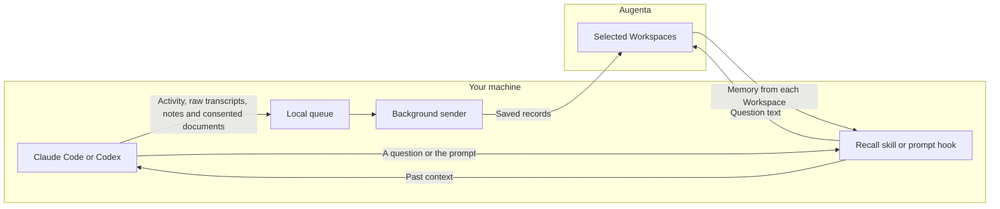

# How the plugin works

The plugin has three jobs: connect a project, save its activity, and ask about
past work. It runs on your machine. Augenta stores the memory and returns
a model-written answer by default; `--context` asks for matching memory instead.

## The two paths

```mermaid
flowchart LR
    subgraph Local[Your machine]
        Agent[Claude Code or Codex]
        Queue[Local queue]
        Sender[Background sender]
        Recall[Recall skill or prompt hook]
        Agent -->|Activity, raw transcripts, notes and consented documents| Queue
        Queue --> Sender
        Agent -->|A question or the prompt| Recall
    end
    subgraph Hosted[Augenta]
        Saved[Selected Workspaces]
    end
    Sender -->|Saved records| Saved
    Recall -->|Question text| Saved
    Saved -->|Memory from each Workspace| Recall
    Recall -->|Past context| Agent
```

Saving happens through **hooks**: small scripts your coding app runs at points
such as the end of a turn. Recall happens two ways. When you submit a prompt,
the prompt hook asks your Workspaces what they remember about it and adds any
match to the conversation for the agent to use or ignore. You or your agent can
also call the recall skill with a question of your own.

This repository contains those scripts and two skills, `connect` and `recall`.
It does not contain the hosted memory engine or train your coding model.

## 1. Connect a project

The [connect script](../scripts/connect.ts) gives you a browser sign-in link. It
lists the Workspaces you can use and asks for the complete set this project
should send to. Nothing is selected on your behalf.

Each Workspace gets its own Connector, owned by the person who connected. The
project config stores the chosen Workspace ids and names, a project key, the
organization, control URL and gateway, and a reference to your saved sign-in. It
names no Connector, so it can be committed. Each checkout keeps its own
Connector ids in `.augenta/state/links.json`. Only those ids route capture, and
the server still authorizes every write and read. Tokens stay in a private file
in your home folder. See [connection settings](configuration.md).

Capture checks for `.augenta/config.json` in the working folder and its
parents. With no readable config, it saves and sends nothing. A browser
connection also needs this machine's saved sign-in for it and this checkout's
own links, because its config may be committed and arrive in checkouts whose
users never chose its Workspaces. Joining links the person's own Connector in
each recorded Workspace, reusing one their other checkouts made for the same
project key. Session start can offer to connect an unconnected project once.

Connect, recall, capture and health use the same local config lookup. It stops
at a Git checkout/worktree boundary, including worktrees nested below another
checkout. Connect defaults to the current checkout, never its main checkout.
Each worktree must be connected explicitly; sibling and main-checkout consent
is not inherited. The nearest config wins, including an invalid config (which
requires reconnecting rather than falling through to another project). An
explicit `--project` targets that directory. See [project resolution](../capture/project.ts).

## 2. Save work locally

The [capture hook](../capture/capture.ts) reads new transcript lines and tracks
where it stopped. For Codex, native `task_started`, `turn_context` and
`task_complete` records determine each logical turn. Their IDs and parser state
are saved with the byte cursor, so a delayed read can contain several turns
without merging them. Records without a known native boundary carry
`turn_source: "unknown"`; messages are never guessed to be turn boundaries.
Claude Code retains its prompt-hook ordinal.

Each checkout records when it joined (a platform-key config records when it was
connected). Codex excludes turns already in progress at that time, including the
connection turn and older history, so joining a project never imports your
earlier sessions. Reconnecting or joining again sets a new time. This does not
expand project-memory capture.

A short project lock serializes capture/append/cursor commits across processes.
A contender waits at most 750 ms, then reports `retry` without changing the cursor;
a later lifecycle event retries. It writes these records to a queue on disk:

- Activity in a common format for Claude Code and Codex.
- Raw transcript records, with some internal fields removed.
- Changed project memory notes, saved as separate documents.
- Supplied text documents and PDFs supplied or referenced in supported file-tool
  records, saved as separate documents after this checkout consents.

Activity and memory notes have common secret patterns removed. Raw transcript
text does not. The [privacy details](../README.md#what-gets-captured) apply to
every selected Workspace.

[Memory capture](../capture/memory.ts) reads Claude's project memory folder or
the sections of Codex's memory file that match the project. It checks for
changes at session start and the end of a turn. It does not scan all source
files in the repository.

[Attachment capture](../capture/attachments.ts) recognizes native Claude file
mentions, SDK document blocks and PDF Read records, including page-range reads
and temporary/generated PDFs. It matches mentions to the user's reference and
parent chain across incremental tails, and excludes compaction restoration.
Codex file adapters await a native fixture; images stay placeholders. Sanitation
removes embedded binary bytes before exclusion, extraction and normalization,
and again when sending older queued raw records. Extraction receives those
removed bytes separately and prefers embedded PDFs over local paths.

A referenced PDF is read once as a bounded regular-file snapshot, checked for
changes to the descriptor and path. Capture never scans directories or fetches
attachments over the network. Text is secret-scrubbed; PDFs are not. Both go in
standalone `type: "doc"` envelopes with `kind: "agent-attachment"`, never in
trajectory events. Project files use a physical project-relative path for
identity; outside-project and pasted documents use content hashes. Revisions
use a content hash and the originating line's timestamp, never the current time.

Attachment consent lives in the checkout's links for browser connections and
in untracked local configs for API keys. Existing connections have no consent
timestamp, so attachments stay off. Older lines and mentions initiated before
consent cannot enable it. The validated atomic attachment index is capped at
4 MiB by evicting the oldest observations. Unchanged content advances its latest
observation time; older/equal-time conflicting revisions are refused. Documents
append with their trajectory under the capture lock, and the index advances only
after that append is accepted. Attachment health is recorded separately.

The capture step writes to disk without waiting for a network request or a
model response.

## 3. Send saved records

The [background sender](../capture/ship.ts) groups records into requests and
sends them to `POST /v1/experiences`. It keeps a separate delivery position
for each Connector, so one Workspace can retry while others receive their
records. They share the same local queue and its limits.

Pending records can survive a restart. Sending is retried at later turn or
session boundaries. This queue is temporary and has limits:

| Limit or failure | What happens |
| --- | --- |
| The queue reaches 50 MiB | New records are dropped until space is available |
| One destination falls more than 16 MiB behind the furthest one | Older queued records can be discarded after three consecutive queue drains in which it sends nothing and another destination makes progress |
| All destinations are offline | That lag rule does not apply; the overall queue limit still does |
| The API rejects a request with 400, 413, or 422 | The sender records the rejection locally, within a 10 MiB limit, and moves on |
| Text documents exceed an envelope | Split into parts below 512 KiB before appending |
| A PDF exceeds an envelope | Skip whole, without truncating bytes; report `attachments: too_large` |
| A pending slice exceeds 2 MiB | Stop before the next record; allow one larger legacy record alone so delivery progresses |
| A network error or other failed HTTP response | The affected records stay queued for a later attempt, subject to the limits above |

Successful delivery resets a destination's lag count. Discards are reported
separately from sign-in problems: discarded records will not be retried.
The queue is not a backup. See [outbox rules](../capture/outbox.ts).

## 4. Recall past work

The [recall script](../scripts/recall.ts) checks the project's Connectors live
and sends a question to `POST /v1/recall` only for active links that still match
their recorded Workspaces. By default it asks
all of them at once. A caller can narrow that set but cannot add an unconnected
Workspace.

The request body holds the question and, for browser sign-in, the Workspace
id. No transcript or file content is attached. The API decides the allowed
organization and memory scope from the signed-in identity. An API key already
fixes the Workspace, so that request needs only the question.

By default the script explicitly requests `?mode=answer` for model-written prose.
`--context` requests `?mode=context` for the matched summary and supporting notes.
A 503 `answerer_unavailable` or `consent_required` triggers one context retry
with the same question and destination, a fresh idempotency key, and a `fallback` marker.
It reports results, empty Workspaces, and failures separately. An
empty Workspace is a normal result. A failure in one is not presented as a
successful answer from all of them.

Disabled, inaccessible, or retargeted links are reported as unresolved and are
not used for recall. A failed Connector check also prevents its question from
being sent, but is reported as a failure rather than a disabled link. Workspace
names are refreshed for display without rewriting the config.

A Workspace refusal after a successful link check retains its code and message
in `failed` alongside the affected unresolved ids. This distinguishes entitlement
denials and archived Workspaces from disabled links. Workspace names are fetched
best-effort after link checks, concurrently with recall, so an all-disabled set
does not trigger a name lookup and name listing never gates the recall POSTs.

The recall command uses the saved project config even when
`AUGENTA_CAPTURE_ENABLED=0`; automatic recall does not. Deleting the config
turns off every path.

### Automatic recall

The [prompt hook](../hooks/auto-recall.ts) runs the same request on each
submitted prompt, through the same [request layer](../capture/recall-client.ts),
with these differences:

- It asks in context mode, so Augenta runs no model for it.
- The question is the prompt, with pasted blocks removed and common secret
  patterns masked. Commands, `$augenta:` mentions, replies under three words and
  prompts over the size limit are not asked.
- One 5-second budget covers everything, including up to two retries of a
  dropped connection or a temporary server error. A timeout or a refusal is not
  retried. Anything short of an answer adds nothing, and the prompt proceeds.
- It never refreshes a sign-in itself. A stale token is renewed by the
  background sender, and the hook waits for it within the budget.
- It runs only while capture is enabled and the project's `autoRecall` answer is
  not `false`. Connect asks that question with Off pre-selected; a config from
  before the question existed keeps it on. `AUGENTA_AUTO_RECALL=0` turns off
  only this path, for every project. A 429 pauses it until the server's retry
  time.

The added text starts with a fixed marker. Capture drops every transcript copy
of it, in both apps and both channels, so recalled memory is not saved again.

## Code map

| Location | Job |
| --- | --- |
| [`skills/`](../skills/) | Instructions the agent follows for connect and recall |
| [`hooks/hooks.json`](../hooks/hooks.json) | Eight app events and the scripts they run |
| [`hooks/`](../hooks/) | Session setup, turn tracking, and automatic recall |
| [`capture/`](../capture/) | Read records, clean them, queue them, and send them |
| [`scripts/connect.ts`](../scripts/connect.ts) | Sign-in and Workspace selection |
| [`scripts/recall.ts`](../scripts/recall.ts) | Ask the selected Workspaces a question |
| [`capture/recall-client.ts`](../capture/recall-client.ts) | The recall request both of those use |
| [`runtime/`](../runtime/) | Shared Node helpers and plugin version |
| [`dist/`](../dist/) | Six ready-to-run Node bundles installed by both apps |
| [`__tests__/contract.test.ts`](../__tests__/contract.test.ts) | Checks the plugin's rules, including key privacy and setup wording |

Contributors use Bun to build and test. Users need Node 20 or newer. Both
marketplaces install the committed bundles without a build step. The build
checks the Bun version and local dependencies so the output stays the same.

See [Contributing](../CONTRIBUTING.md) for checks and
[AGENTS.md](../AGENTS.md) for the full rules on packaging, releases, and privacy.
